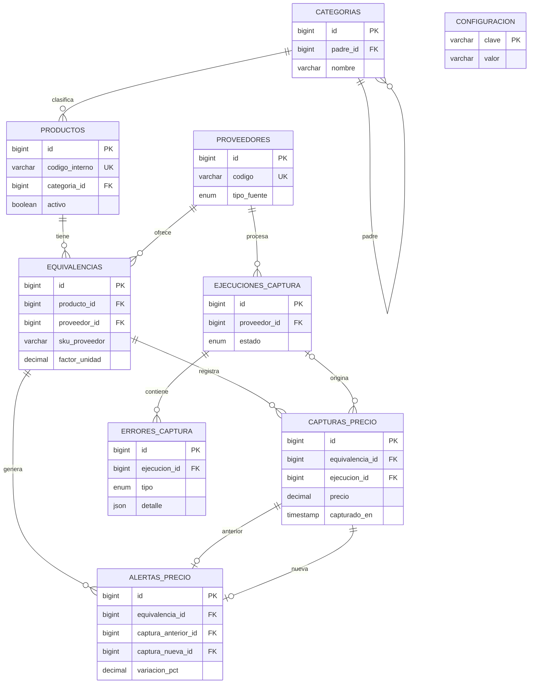

# Diagrama entidad-relación (MySQL 8 / InnoDB)

```mermaid
erDiagram
  CATEGORIAS ||--o{ CATEGORIAS : padre
  CATEGORIAS ||--o{ PRODUCTOS : clasifica
  PRODUCTOS ||--o{ EQUIVALENCIAS : tiene
  PROVEEDORES ||--o{ EQUIVALENCIAS : ofrece
  PROVEEDORES ||--o{ EJECUCIONES_CAPTURA : procesa
  EQUIVALENCIAS ||--o{ CAPTURAS_PRECIO : registra
  EJECUCIONES_CAPTURA o|--o{ CAPTURAS_PRECIO : origina
  EJECUCIONES_CAPTURA ||--o{ ERRORES_CAPTURA : contiene
  EQUIVALENCIAS ||--o{ ALERTAS_PRECIO : genera
  CAPTURAS_PRECIO ||--o| ALERTAS_PRECIO : anterior
  CAPTURAS_PRECIO ||--o| ALERTAS_PRECIO : nueva

  CATEGORIAS { bigint id PK bigint padre_id FK varchar nombre }
  PRODUCTOS { bigint id PK varchar codigo_interno UK bigint categoria_id FK boolean activo }
  PROVEEDORES { bigint id PK varchar codigo UK enum tipo_fuente }
  EQUIVALENCIAS { bigint id PK bigint producto_id FK bigint proveedor_id FK varchar sku_proveedor decimal factor_unidad }
  CAPTURAS_PRECIO { bigint id PK bigint equivalencia_id FK bigint ejecucion_id FK decimal precio timestamp capturado_en }
  EJECUCIONES_CAPTURA { bigint id PK bigint proveedor_id FK enum estado }
  ERRORES_CAPTURA { bigint id PK bigint ejecucion_id FK enum tipo json detalle }
  CONFIGURACION { varchar clave PK varchar valor }
  ALERTAS_PRECIO { bigint id PK bigint equivalencia_id FK bigint captura_anterior_id FK bigint captura_nueva_id FK decimal variacion_pct }
```

`vw_precio_vigente` usa `ROW_NUMBER()` particionado por equivalencia para obtener la última captura de forma determinista.
